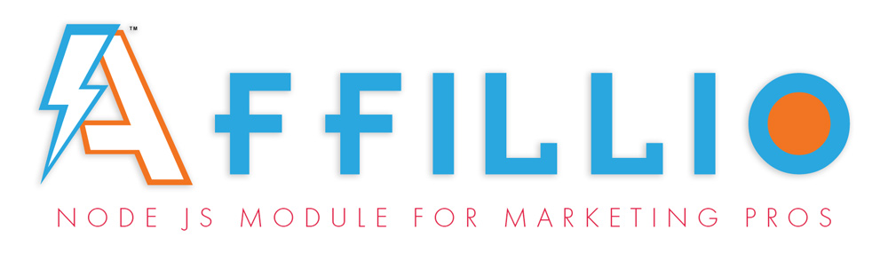

Affillio - The Market Hunter
======
NodeJS Scraping Framework for Affiliate Marketing Apps

  
  
  	:: Under Heavy Construction ::
  

Affillio module is written in [TypeScript 2](https://www.typescriptlang.org/docs/home.html) (ES6). Install Affillio into your existing project with minor configuration or get extreme plug-n-play with [AfloCommerce](https://github.com/MichaelLogic/AfloCommerce.git).

Getting Started
------------
`npm install affillio`

## Major Affillio Dev issues 
- Reorganization of Prey Class and its execution method

- Heavy Affillio functions development in progress:  This open-source project has been exposed to empower technology firms currently working with Michael Logic™ Administration. Please be aware that this project is in version 0.1+ release and will change drastically at the publish of Affillio v.1.0.  

# The Birth of the AfloHunter Class
The "hunter" can be seen like as the method man that carries out the tasks of:
- scraping Catalog Sources
- providing code pattern intel to Affillio Module
- managing the interpretation of incoming data for conversion to a Suggested Good
- classification and regression of scraped data for machine learning
- broadcasting hunter status

## COMING SOON! ##
- Full encapsulation of Affillio AI Module
- increased intelligence for intepereting content from affiliate partner sources
- Thorough unit spec tests

